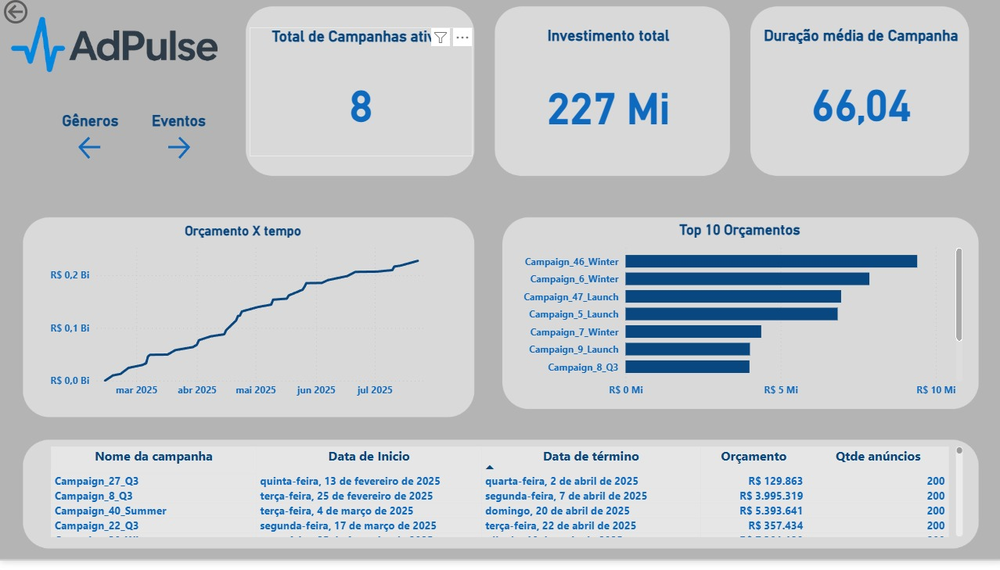
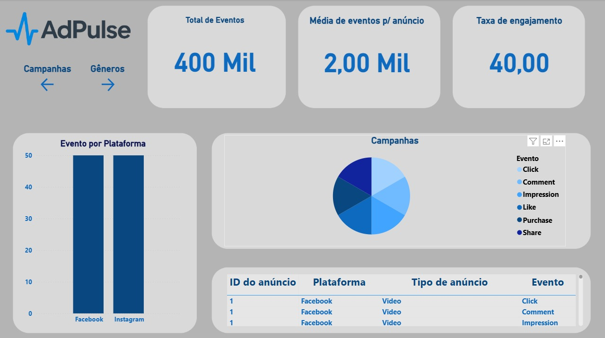
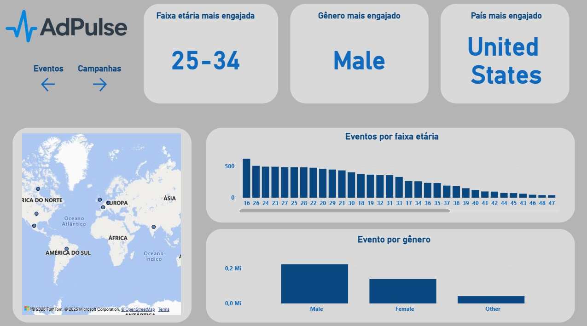

# Social Media Analytics – Dashboard em Power BI

Dashboard interativo desenvolvido em **Power BI** para visualizar e analisar desempenho em redes sociais como Facebook, Twitter, e Instagram.

---

##  Objetivo

Transformar dados de redes sociais em insights acionáveis por meio de uma interface visual, permitindo:

- Consolidar informações dispersas em uma única visão analítica.
- Acompanhar a performance de campanhas em termos de duração, orçamento e volume de anúncios.
- Medir o engajamento dos usuários por tipo de evento, plataforma e período de tempo.
- Identificar o perfil do público-alvo mais engajado, considerando faixa etária, gênero e localização.
- Proporcionar navegação intuitiva entre diferentes visões (Campanhas, Eventos e Audiência), facilitando a tomada de decisão baseada em dados.

---

##  Demonstração Visual

  

  

  

---

##  Ferramentas & Técnicas Utilizadas

- **Power BI Desktop** – Ferramenta principal para criação e modelagem visual.
- **DAX (Data Analysis Expressions)** – Criação de cálculos e métricas personalizados.
- **Fontes de dados** – Importação via CSV/Excel/API das redes sociais.
- **Power BI Service (opcional)** – Publicação e compartilhamento interativo.

